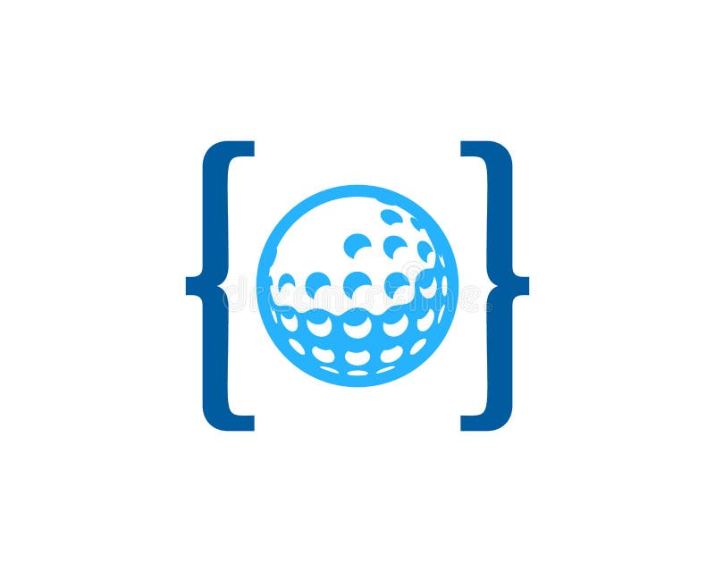

# Code Golf Playground

Welcome to my Code Golf Playground! ⛳️



## Table of Contents

- [Introduction](#introduction)
- [Challenges](#challenges)
- [Playing Along](#playing-along)
- [Contributing](#contributing)
- [License](#license)

## Introduction

This repository is a collection of my solutions to various code golf challenges. Code golf is a unique and enjoyable way to solve programming problems with the objective of minimizing code size.

Feel free to explore my golfed code and learn different techniques used in the art of code golfing!

## Challenges

All challenges are organized within the `src` folder. Each challenge has its own subfolder named like "hole X - [challenge name]," containing the challenge prompt and my golfed solution.

For example:
```
src/
|-- hole 1 - FizzBuzz
|   |-- prompt.txt
|   |-- solution.js
|-- hole 2 - PI
|   |-- prompt.txt
|   |-- solution.py
```

## Playing Along

If you're interested in playing along, head over to [code.golf](https://code.golf) and explore the challenges there. Feel free to fork this repository, add your own solutions, and submit pull requests to share your golfing prowess!

## Contributing

Contributions are welcome! If you have a new challenge idea, found a more efficient solution, or want to discuss code golfing techniques, check the [Contribution Guidelines](./CONTRIBUTING.md) for details on how to get involved.

## License

This project is licensed under the [MIT License](./LICENSE), allowing you to freely use and distribute the code. See the [LICENSE](./LICENSE) file for more details.

Happy golfing! ⛳️
